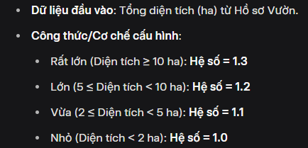

1. Công thức tính hệ số phức tạp của vườn
   HS Phức tạp = HS*GiaiĐoạn × HS_YêuCầuKT × HS_RủiRo × HS_DiệnTích × HS_KhoảngCách × HS*ĐầuTư × HS_HỗTrợ × HS_HợpĐồng × HS_TiềmNăng
   Note: Các hệ số không có thì sẽ không xuất hiện trong phép tính

2. Các hệ số tính tự động ở đánh giá độ phức tạp vườn
   2.1. Hệ số quy mô diện Hệ số quy mô diện tích
   

2.2. Hệ số Giai đoạn (Hỗn hợp)

2.3. Hệ số khoảng cách & địa hình

Note: Chỉ cần quan tâm dữ liệu đầu vào, công thức ở dưới là ví dụ, chỗ này ban quản lý sẽ cấu hình
